<picture>
  <source media="(prefers-color-scheme: dark)" srcset="./assets/gif/profile_dark.gif">
  <source media="(prefers-color-scheme: light)" srcset="./assets/gif/profile_light.gif">
  
</picture>

<h1> 🌎 Hello world!</h1>

My name is **Andrezza** and I'm a Full Stack Developer!

I graduated in International Relations mostly because of my love of foreign languages and my desire to troubleshoot conflicts to make the world a better place. Now, I know new kinds of languages — programming languages — and troubleshoot other types of conflicts — version conflicts.

Coding to me feels like having play-doh in my hands that I can mold however I want. It's an amazingly creative feeling and the sky is not the limit! I love it!

I've worked as a Full Stack Development tutor for 2 years. In that position, I helped students become full stack developers like me. It was one of the best experiences I've ever had and one of the coolest things I've ever done!

Currently, I'm studying Java and looking for a new job as a software developer. Metaphorically, I've shown people how to make play-doh figures, now I want to work on my own figures. If you know of any interesting job openings, please, <a href="#talk">let me know</a>!

 

<h3>Fun facts</h3>
<ul>
  <li>I speak 3 human languages and 2 programming language. Languages help me connect with new people (and machines). They also allow me to learn new things, and see the world and other cultures through brand new eyes.</li>
  <li>I first meddled with code when I was 11 and wanted to improve the template of my blog.</li>
  <li>I'm a cat person and I'll always smile if your cat appears in a Zoom meeting!</li>
</ul>
 

<h2 id="talk"> 💬 Talk to me</h2>

  
You can find me here:

  
  
  
   
   

<h2>🧠 What I use</h2>
 
<table>
  <tbody>
    <tr>
      <td>
        
        &nbsp JavaScript
      </td>
      <td>
        
        &nbsp TypeScript
      </td>
      <td>
        
        &nbsp Node.js
      </td>
      <td>
        
        &nbsp npm
      </td>
      <td>
        
        &nbsp Express
      </td>
    </tr>
    <tr>
      <td>
        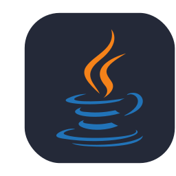
        &nbsp Java
      </td>
      <td>
        
        &nbsp HTML
      </td>
      <td>
        
        &nbsp CSS
      </td>
      <td>
        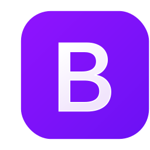
        &nbsp Bootstrap
      </td>
      <td>
        
        &nbsp TailwindCSS
      </td>
    </tr>
    <tr>
      <td>
        
        &nbsp React
      </td>
      <td>
        
        &nbsp Styled Components
      </td>
      <td>
        
        &nbsp PostgreSQL
      </td>
      <td>
        
        &nbsp MongoDB
      </td>
      <td>
        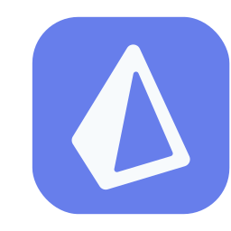
        &nbsp Prisma
      </td>
    </tr>
    <tr>
      <td>
        
        &nbsp Git
      </td>
      <td>
        
        &nbsp Jest
      </td>
      <td>
        
        &nbsp Cypress
      </td>
      <td>
        
        &nbsp VS Code
      </td>
      <td>
        
        &nbsp Bash
      </td>
    </tr>
    <tr>
      <td>
        
        &nbsp Github
      </td>
      <td>
        
        &nbsp Figma
      </td>
      <td>
        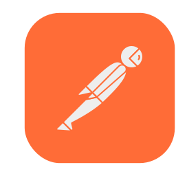
        &nbsp Postman
      </td>
      <td>
        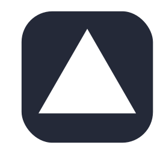
        &nbsp Vercel
      </td>
      <td>
        
        &nbsp Linux
      </td>
    </tr>
  </tbody>
</table>

 
 

<h2>📚 What I'm learning</h2>
 
<table>
  <tbody>
    <tr>
      <td>
        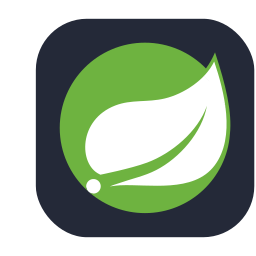
        &nbsp Spring
      </td>
      <td>
        
        &nbsp Go Lang
      </td>
      <td>
        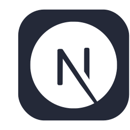
        &nbsp Next.js
      </td>
      <td>
        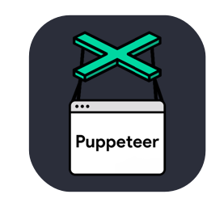
        &nbsp Puppeteer
      </td>
      <td>
        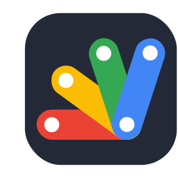
        &nbsp Apps Script
      </td>
    </tr>
    <tr>
      <td>
        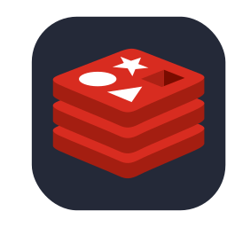
        &nbsp Redis
      </td>
      <td>
        
        &nbsp NGINX
      </td>
      <td>
        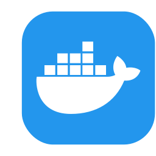
        &nbsp Docker
      </td>
      <td>
        
        &nbsp AWS
      </td>
      <td>
        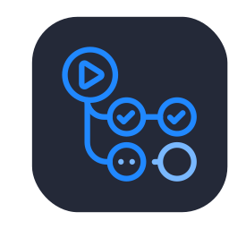
        &nbsp GitHub Actions
      </td>
    </tr>
  </tbody>
</table>

 
 

<h2>👀 Next technologies</h2>
 
<table>
  <tbody>
    <tr>
      <td>
        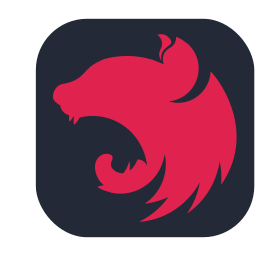
        &nbsp Nest.js
      </td>
      <td>
        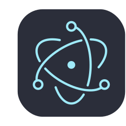
        &nbsp Electron
      </td>
      <td>
        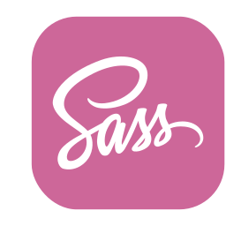
        &nbsp Sass
      </td>
    </tr>
  </tbody>
</table>

 
 

<h2>💻 Currently working on</h2>

At the moment, I'm concentrating on deepening and expanding my knowledge of technologies related to programming. To know more, you can <a href="#talk">talk to me</a> or <a href="https://github.com/andrezzasouza?tab=repositories">take a look at my repositories</a>!

 

  
  
   

[//]: # "Icons from https://github.com/tandpfun/skill-icons"
