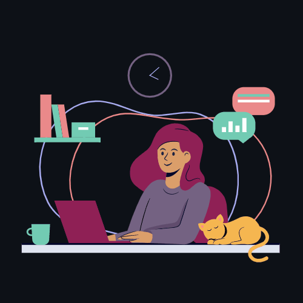

<picture>
  <source media="(prefers-color-scheme: dark)" srcset="./assets/profile_dark.gif">
  <source media="(prefers-color-scheme: light)" srcset="./assets/profile_light.gif">
  
</picture>

<h1> 🌎 Hello world!</h1>

My name is **Andrezza** and I'm a Full Stack Developer!

I graduated in International Relations mostly because of my love of foreign languages and my desire to troubleshoot conflicts to make the world a better place. Now, I know new kinds of languages – programming languages – and troubleshoot other types of conflicts – version conflicts.

Coding to me feels like having play-doh in my hands that I can mold however I want. It's an amazingly creative feeling and the sky is not the limit! I love it!

Currently, I work as a tutor and help students become full stack developers as well.
 

<h3>Fun facts</h3>
<ul>
  <li>I speak 3 human languages and 1 programming language. Languages help me connect with new people (and machines). They also allow me to learn new things, and see the world and other cultures through brand new eyes.</li>
  <li>I first meddled with code when I was 11 and wanted to improve the template of my blog.</li>
  <li>I'm a cat person and I'll always smile if your cat appears in a Zoom meeting!</li>
</ul>
 

<h2 id="talk"> 💬 Talk to me</h2>

  
You can find me here:

  
  
  
   
   

<h2>🧠 What I use</h2>
 

  &nbsp;
  
  
  
  
  
  
  &nbsp;
  &nbsp;
  
  
  &nbsp;
  
  &nbsp;
  &nbsp;&nbsp;
  &nbsp;
  &nbsp;
  &nbsp;

   
   

<h2>📚 What I'm learning</h2>
 

  &nbsp;
  &nbsp;
  &nbsp;&nbsp;
  &nbsp;&nbsp;
  &nbsp;&nbsp;
  &nbsp;&nbsp;
  &nbsp;&nbsp;&nbsp;
  

   
   

<h2>👀 Next technologies</h2>
 

  &nbsp;&nbsp;&nbsp;
  &nbsp;
  &nbsp;&nbsp;
  

   
   

 

<h2>💻 Currently working on</h2>

At the moment, I'm concentrating on deepening and expanding my knowledge of technologies related to programming. To know more, you can <a href="#talk">talk to me</a> or <a href="https://github.com/andrezzasouza?tab=repositories">take a look at my repositories</a>!

  
  

