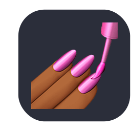

<picture>
  <source media="(prefers-color-scheme: dark)" srcset="./assets/gif/profile_dark.gif">
  <source media="(prefers-color-scheme: light)" srcset="./assets/gif/profile_light.gif">
  
</picture>

<h1> 🌎 Hello world!</h1>

My name is **Andrezza** and I'm a Full Stack Developer!

I graduated in International Relations mostly because of my love of foreign languages and my desire to troubleshoot conflicts to make the world a better place. Now, I know new kinds of languages – programming languages – and troubleshoot other types of conflicts – version conflicts.

Coding to me feels like having play-doh in my hands that I can mold however I want. It's an amazingly creative feeling and the sky is not the limit! I love it!

I've worked as a Full Stack Development tutor for 2 years. In that position, I helped students become full stack developers like me. It was one of the best experiences I've ever had and one of the coolest things I've ever done!

Currently, I'm studying Java and looking for a new job as a software developer. Metaphorically, I've shown people how to make play-doh figures, now I want to work on my own figures. If you know of any interesting job openings, please, <a href="#talk">let me know</a>!

 

<h3>Fun facts</h3>
<ul>
  <li>I speak 3 human languages and 2 programming language. Languages help me connect with new people (and machines). They also allow me to learn new things, and see the world and other cultures through brand new eyes.</li>
  <li>I first meddled with code when I was 11 and wanted to improve the template of my blog.</li>
  <li>I'm a cat person and I'll always smile if your cat appears in a Zoom meeting!</li>
</ul>
 

<h2 id="talk"> 💬 Talk to me</h2>

  
You can find me here:

  
  
  
   
   

<h2>🧠 What I use</h2>
 
<table>
  <tbody>
    <tr>
      <td>
        
        &nbsp&nbspJavaScript
      </td>
      <td>
        
        &nbsp&nbspTypeScript
      </td>
      <td>
        
        &nbsp&nbspNode.js
      </td>
      <td>
        
        &nbsp&nbspnpm
      </td>
      <td>
        
        &nbsp&nbspExpress
      </td>
    </tr>
    <tr>
      <td>
        
        &nbsp&nbspJava
      </td>
      <td>
        
        &nbsp&nbspHTML
      </td>
      <td>
        
        &nbsp&nbspCSS
      </td>
      <td>
        
        &nbsp&nbspBootstrap
      </td>
      <td>
        
        &nbsp&nbspTailwindCSS
      </td>
    </tr>
    <tr>
      <td>
        
        &nbsp&nbspReact
      </td>
      <td>
        
        &nbsp&nbspStyled Components
      </td>
      <td>
        
        &nbsp&nbspPostgreSQL
      </td>
      <td>
        
        &nbsp&nbspMongoDB
      </td>
      <td>
        
        &nbsp&nbspPrisma
      </td>
    </tr>
    <tr>
      <td>
        
        &nbsp&nbspGit
      </td>
      <td>
        
        &nbsp&nbspJest
      </td>
      <td>
        
        &nbsp&nbspCypress
      </td>
      <td>
        
        &nbsp&nbspVS Code
      </td>
      <td>
        
        &nbsp&nbspBash
      </td>
    </tr>
    <tr>
      <td>
        
        &nbsp&nbspGithub
      </td>
      <td>
        
        &nbsp&nbspFigma
      </td>
      <td>
        
        &nbsp&nbspPostman
      </td>
      <td>
        
        &nbsp&nbspVercel
      </td>
      <td>
        
        &nbsp&nbspLinux
      </td>
    </tr>
  </tbody>
</table>

 
 

<h2>📚 What I'm learning</h2>
 
<table style="width:100%">
  <tbody>
    <tr>
      <td>
        
        &nbsp&nbspSpring
      </td>
      <td>
        
        &nbsp&nbspNext.js
      </td>
      <td>
        
        &nbsp&nbspApps Script
      </td>
      <td>
        
        &nbsp&nbspPuppeteer
      </td>
      <td>
        
        &nbsp&nbspRedis
      </td>
    </tr>
    <tr>
      <td>
        
        &nbsp&nbspNGINX
      </td>
      <td>
        
        &nbsp&nbspDocker
      </td>
      <td>
        
        &nbsp&nbspAWS
      </td>
      <td>
        
        &nbsp&nbspGitHub Actions
      </td>
    </tr>
  </tbody>
</table>

 
 

<h2>👀 Next technologies</h2>
 
<table>
  <tbody>
    <tr>
      <td>
        
        &nbsp&nbspNest.js
      </td>
      <td>
        
        &nbsp&nbspGo Lang
      </td>
      <td>
        
        &nbsp&nbspElectron
      </td>
      <td>
        
        &nbsp&nbspSass
      </td>
    </tr>
  </tbody>
</table>

 
 

<h2>💻 Currently working on</h2>

At the moment, I'm concentrating on deepening and expanding my knowledge of technologies related to programming. To know more, you can <a href="#talk">talk to me</a> or <a href="https://github.com/andrezzasouza?tab=repositories">take a look at my repositories</a>!

 

  
  
   

[//]: # (Icons from https://github.com/tandpfun/skill-icons)
